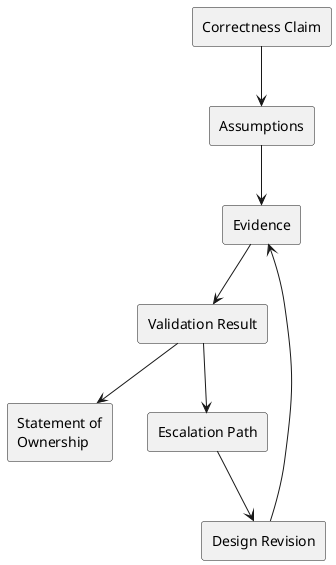

# The Integrity Packet

## Video: https://youtu.be/g7cvA0jWNRo
## Metadata
- Week: 1
- Lecture: The Integrity Packet
- Duration: 15 minutes
- Prerequisites: Basic software documentation, testing evidence, AI disclosure expectations
- Assignment Alignment: [A0 - Project Selection, Environment & Integrity Packet](../../../assignments/A0/index.md), [Integrity Packet Template](../../../assignments/shared/integrity-packet-template.md)

## Learning Objectives
- Analyze the Integrity Packet as an engineering evidence artifact.
- Evaluate whether a correctness claim is supported by sufficient evidence.
- Design an Integrity Packet structure that can evolve across assignments.
- Defend assumptions, validation steps, and ownership claims in an oral review.
- Diagnose gaps between implementation behavior and documented evidence.

## Opening Narrative
A team claims its publishing workflow is safe because the final demo succeeded. When asked for proof, the team shows a screenshot of one successful run. There is no failing baseline, no concurrent test output, no record of assumptions, and no explanation of what happens when publishing fails halfway through. The system may work, but the claim is not yet defensible.

What evidence must a student preserve so another engineer can trust the design argument?

## Core Concepts

### Ownership and Responsibility
- Definition: A clear statement of who is responsible for the claim, the evidence, and the final submission.
- Why it matters: AI-assisted work and concurrent systems both create opportunities to outsource judgment.
- Mechanism: The packet records decisions, assumptions, validation, and final certification.
- Failure mode: A student submits plausible output they cannot explain.
- Design implication: Ownership must be explicit and reviewable.

### Evidence-Based Design
- Definition: A design claim supported by logs, tests, traces, command output, or other inspectable artifacts.
- Why it matters: Correctness under concurrency cannot be inferred from intent.
- Mechanism: Evidence connects system behavior to the invariant being defended.
- Failure mode: "I think it works" replaces repeatable validation.
- Design implication: Every major claim should point to evidence.

### Assumption Tracking
- Definition: A record of conditions the design depends on.
- Why it matters: Concurrency failures often occur when assumptions about order, retries, or ownership are false.
- Mechanism: Assumptions are written before or during implementation and revisited after failure tests.
- Failure mode: Hidden assumptions remain hidden until production-like pressure appears.
- Design implication: Assumptions should be testable whenever possible.

### Escalation Path
- Definition: A documented response when the system reaches a state automated logic cannot safely resolve.
- Why it matters: Correct systems still need human review paths for ambiguous or unsafe states.
- Mechanism: The packet identifies what should halt, alert, retry, compensate, or require review.
- Failure mode: The system silently proceeds after uncertainty.
- Design implication: Failure handling is part of the design, not an afterthought.

## System / Architecture View



The Integrity Packet is a trace from claim to evidence. It should show what changed when evidence contradicted the original design.

## Worked Example

### Problem Setup
In the podcast domain, a student claims that an episode cannot be published until all assets are complete.

### Naive Documentation

```text
The system checks asset status before publishing.
```

This statement is not enough. It does not identify the invariant, the command used, the log output, or the failure behavior.

### Failure Scenario
A concurrent test starts transcript processing and publishing at nearly the same time. The publish command observes stale state and publishes early. The packet must capture the assumption that reads are current, then show that the assumption failed.

### Improved Integrity Packet Entry

```markdown
## Recommendation
Use an atomic readiness check before transitioning Episode to PUBLISHED.

## Assumptions
- Publishing requires audio, transcript, artwork, and review approval.
- The readiness check and status transition must behave as one operation.

## Evidence
- `evidence/logs/publish_race_before.jsonl` shows publish succeeded while transcript was PENDING.
- `evidence/logs/publish_race_after.jsonl` shows publish rejected until all assets were COMPLETE.

## Validation
- Ran `scripts/run-concurrent-publish-test.sh` with 5 workers and 100 repetitions.
- No invalid PUBLISHED state observed after redesign.

## Ownership
I can explain the failed interleaving and the corrected transition.
```

This is safer because the design claim is tied to repeatable evidence.

## Visual Model Anchors

### System Interaction
Actors:
- Load driver
- API gateway
- Worker pool
- Database
- Metrics and log store

Flow:
- Load driver sends concurrent podcast or order workflow requests
- API gateway assigns correlation IDs and forwards work
- Worker pool processes state transitions while metrics and logs capture latency, errors, and retries

Diagram intent:
- Show the normal interaction before Ownership and Responsibility is placed under pressure.

### State Transition Model
States:
- HEALTHY
- SATURATED
- DEGRADED
- RECOVERING
- STABLE

Transitions:
- HEALTHY -> SATURATED: request rate exceeds worker capacity
- SATURATED -> DEGRADED: queue depth and p95 latency cross threshold
- DEGRADED -> RECOVERING: load is reduced or backpressure starts
- RECOVERING -> STABLE: error rate and queue depth return to baseline

Invariant:
- The system either completes accepted work or exposes bounded degradation with enough evidence to recover.

### Failure Interleaving
Interleaving:
T1: Load test pushes 200 concurrent publish requests
T2: Worker pool retries slow database writes while the queue keeps accepting new work

Failure:
- Latency spikes, duplicate work, missing completion logs, or unbounded queue growth.

Violated invariant:
- The system either completes accepted work or exposes bounded degradation with enough evidence to recover.

### Failure Scenario
Pressure:
- Sustained load, partial database slowdown, and retry storms during recovery.

Observed:
- Latency spikes, duplicate work, missing completion logs, or unbounded queue growth.

Root cause:
- The baseline design assumed normal load and treated failure evidence as optional.

Evidence:
- Load profile, p50/p95/p99 latency, queue depth, retry counts, error logs, and recovery timeline.

### Design Response
Protected property:
- System integrity remains explainable when capacity, timing, or dependencies fail.

Mechanism:
- Backpressure, bounded retries, circuit breakers, compensation, reconciliation, and evidence dashboards.

Trade-off:
- Reduced peak throughput or delayed work in exchange for controlled recovery.

Diagram intent:
- Show the baseline path beside the corrected path and label the point where the invariant is protected.

### Evidence Flow
Claim:
- The Integrity Packet is defensible when the design shows both the failure and the recovery path with measurements.

Evidence:
- Load profile, p50/p95/p99 latency, queue depth, retry counts, error logs, and recovery timeline.

Review question:
- Which metric tells you the system is degraded but still controlled?

Decision:
- Accept a design only when its stress evidence includes baseline, failure, correction, and residual risk.
## Failure Modes and Anti-Patterns

- Symptom: The packet repeats the final answer but not the reasoning.
  - Why it happens: Documentation is treated as a report rather than an audit trail.
  - How to detect it: There is no record of failed attempts or revisions.
  - How to correct it: Preserve prompts, assumptions, critiques, and before/after evidence.

- Symptom: Evidence does not support the claim.
  - Why it happens: Logs are captured but not connected to invariants.
  - How to detect it: A reviewer cannot tell which line proves the claim.
  - How to correct it: Annotate evidence with the claim it supports.

- Symptom: AI usage is disclosed but not evaluated.
  - Why it happens: Students list prompts without critiquing outputs.
  - How to detect it: There is no accepted/rejected/verified distinction.
  - How to correct it: Add an AI critique section with verification results.

- Symptom: Escalation is missing.
  - Why it happens: The design assumes all failures are recoverable automatically.
  - How to detect it: No rule explains what happens after repeated or ambiguous failure.
  - How to correct it: Define halt, retry, compensate, alert, or human-review behavior.

## Trade-Off Analysis

| Approach | Strengths | Weaknesses | When to Use |
|---|---|---|---|
| Minimal reflection | Fast to write | Weak evidence and poor defensibility | Not sufficient for course submissions |
| Evidence log only | Captures raw behavior | Lacks interpretation | Useful as supporting material |
| Structured Integrity Packet | Connects claims, evidence, validation, ownership | Requires discipline | Required across assignments |
| AI usage log only | Helps disclosure | Does not prove correctness | Use alongside the packet |
| Oral defense preparation | Reveals gaps quickly | Requires time and practice | Before submission and review |

## Practical Application

Tomorrow morning:

- Create `integrity-packet/individual-integrity-packet.md`.
- Add sections for recommendation, assumptions, evidence, validation, ownership, and escalation.
- Add an AI usage log.
- Write one testable assumption about your selected domain.
- Capture one command output or screenshot that proves your environment works.
- Link evidence to the claim it supports.
- Prepare to explain the packet without reading it.

## Assignment Integration

This lecture supports [A0 - Project Selection, Environment & Integrity Packet](../../../assignments/A0/index.md). A0 requires students to create the initial packet that will be updated through A1-A4.

The student should demonstrate that the packet is reusable, specific to the selected domain, and tied to correctness under concurrency. Evidence of mastery includes assumptions that can be tested, validation steps that can be repeated, and a clear ownership statement.

## Validation and Interview Questions

1. What is the difference between a claim and evidence?
2. Which assumption in your project is most likely to fail under concurrency?
3. How would a reviewer reproduce one of your validation steps?
4. What AI-generated suggestion did you reject, and why?
5. What should your system do when automated recovery is unsafe?
6. How does the Integrity Packet change your responsibility for correctness?
7. What evidence would be insufficient for defending a concurrency fix?

## Summary

The central insight is that correctness is not only implemented; it is argued with evidence. The Integrity Packet gives students a disciplined way to connect assumptions, behavior, validation, AI use, and ownership. This mirrors professional engineering practice, where decisions must be explainable after systems fail.

## Further Reading

- [A0 Integrity Packet requirements](../../../assignments/A0/index.md)
- [Shared Integrity Packet Template](../../../assignments/shared/integrity-packet-template.md)
- Topic: Engineering decision records
- Topic: Incident postmortems and corrective actions
- Search phrase: "software traceability evidence validation"
