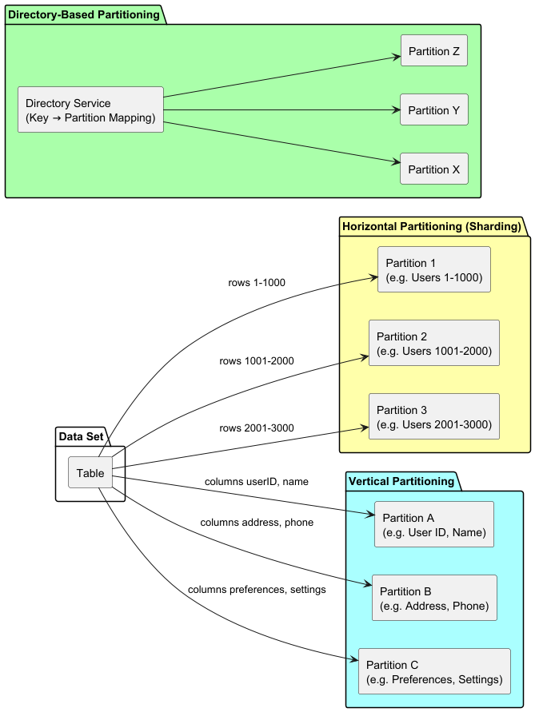
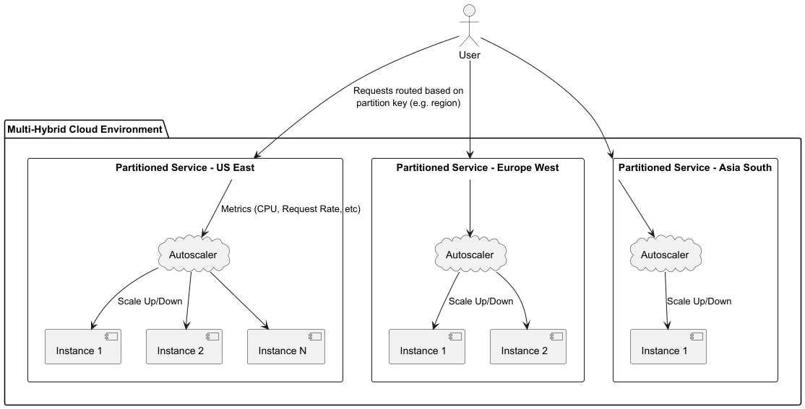
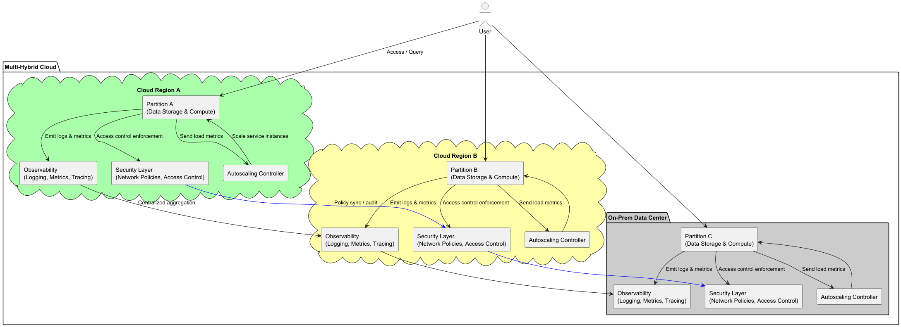

= Data Partitioning in Multi-Hybrid Cloud
:revealjsdir: https://cdn.jsdelivr.net/npm/reveal.js@5
:revealjs_theme: white
:revealjs_controls: true
:revealjs_slideNumber: true
:imagesdir: .
:icons: font
:sectnums: false
:source-highlighter: highlightjs

== Data Partitioning in Multi-Hybrid Cloud
== Concepts and Cloud-Native Operational Impacts

Video: https://youtu.be/IlyODi61Eh4

---

== 1. Introduction
== Why Data Partitioning Matters in Multi-Hybrid Cloud

- Scalability and performance
- Fault tolerance and resilience
- Regulatory compliance and data sovereignty
- Cost-effective resource utilization

*Enables efficient distributed data management across clouds and on-premises.*

---

== 2. Data Partitioning Fundamentals

== What is Data Partitioning?

- Dividing large data sets into independently managed partitions or shards
- Supports parallel processing and optimized operations

---

== 2.1 Main Partitioning Strategies

- *Horizontal Partitioning (Sharding):*  
  Split data rows by key (e.g., region or customer ID)
- *Vertical Partitioning:*  
  Split by columns to separate access/sensitivity
- *Directory-Based Partitioning:*  
  Use a lookup service to map keys to partitions dynamically

---

(Horizontal vs Vertical vs Directory-based) showing data slices and mapping.

---

== 2.2 Data Placement in Multi-Hybrid Cloud

- Distribute partitions across public clouds, private data centers, edge locations
- Placement based on latency, compliance, cost, workload

---

== 3. Challenges in Multi-Hybrid Cloud Data Partitioning

- Latency & limited inter-cloud bandwidth
- Balancing consistency (strong vs eventual)
- Complex query routing and partition management
- Security and governance across trust boundaries

---

== 4. Best Practices

- Align partition keys with natural application usage
- Automate routing and query management
- Leverage cloud-native partitioning and replication features
- Continuously monitor partition health/performance
- Enforce strict partition-level security policies
- Plan disaster recovery for partition backups

---

== 5. Operational Impact of Data Partitioning

== a) Observability

- Unified logging & metrics aggregated from all partitions
- Dashboards showing partition-wise load, latency, replication status, and errors
- Distributed tracing for requests crossing partitions and clouds

---

== b) Autoscaling

- Autoscale compute instances per partition independently
- Intelligent load balancing to route traffic to correct partitions
- Detect and mitigate hot partitions with targeted scaling
- Use Kubernetes HPA or cloud autoscaling groups with partition-aware metrics

---

*Autoscaling architecture showing multiple partitioned services with scaling based on partition load.*

---

== c) Security

- Partition-scoped access controls with RBAC and network policies
- Secret management for credentials and encryption keys per partition
- Encryption of data at rest and in transit, partition by partition
- Network segmentation isolating partition communication
- Audit logs tracking access/modifications per partition

---

== 6. Summary

- Data partitioning enables scalable, resilient, and compliant multi-hybrid cloud systems
- Requires integrated approaches to observability, autoscaling, and security
- Proper management unlocks agility and flexibility with performance and compliance

---

*Data partitions distributed across clouds showing observability, autoscaling, and security layers.*
