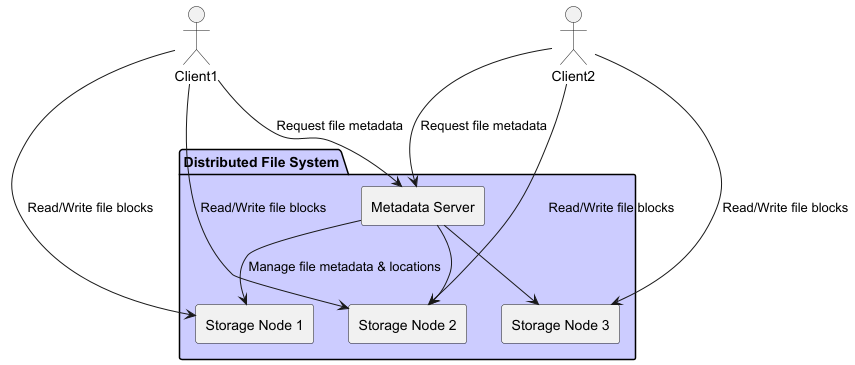
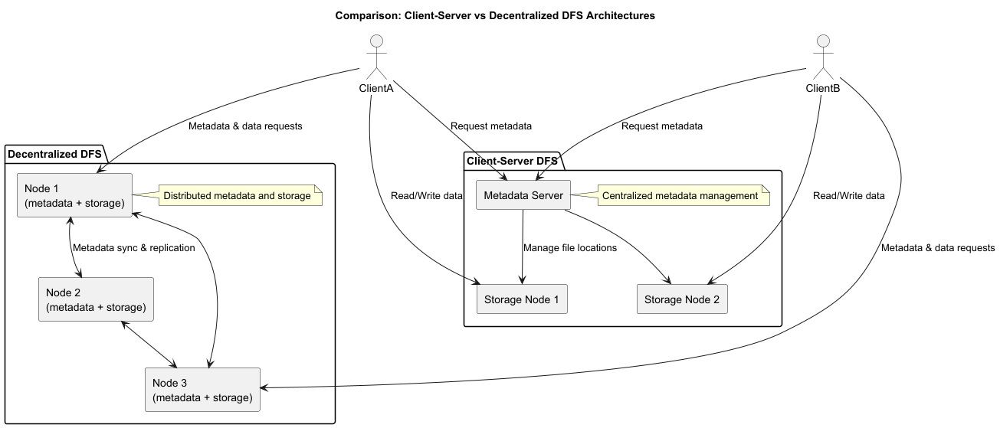
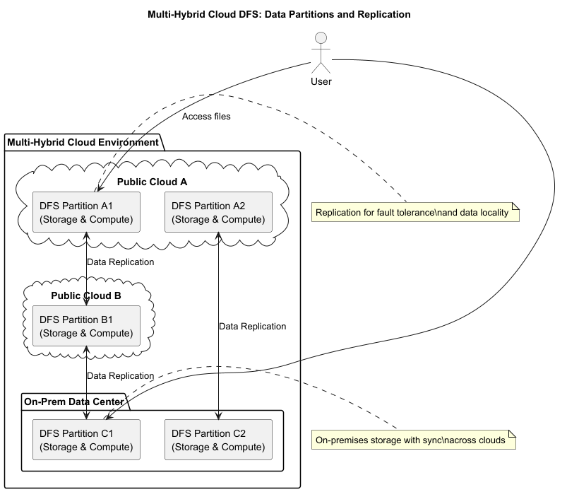
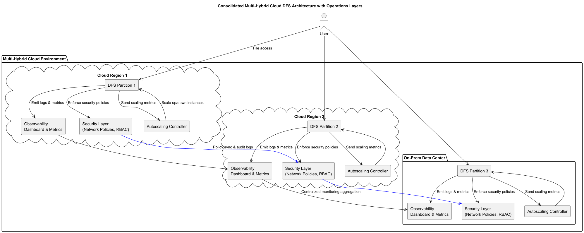

= Distributed File Systems in Multi-Hybrid Cloud Environments
:revealjsdir: https://cdn.jsdelivr.net/npm/reveal.js@5
:revealjs_theme: white
:revealjs_controls: true
:revealjs_slideNumber: true
:imagesdir: .
:icons: font
:sectnums: false
:source-highlighter: highlightjs

== Distributed File Systems in Multi-Hybrid Cloud Environments

Video: https://youtu.be/0j5bF8teIC0

---

== 1. Introduction to Distributed File Systems (DFS)

- *Definition:* Distributed File Systems enable unified access to files stored across multiple physical machines or locations.
- *Purpose:*
    - Scale storage beyond single devices
    - Achieve high availability and fault tolerance
    - Enable seamless sharing in distributed teams/environments

---

Basic DFS architecture showing clients interacting with multiple storage nodes providing a unified namespace.

---

== 2. Core Characteristics of Distributed File Systems

- *Transparency:* Location and access transparency, hiding complexity from users.
- *Scalability:* Ability to grow with increasing data size and user count.
- *Fault Tolerance:* Replication and automatic recovery features.
- *Consistency & Concurrency:* Coordination among clients to maintain correct views.
- *Security:* Fine-grained access control and encryption.

---

== 3. Common DFS Architectures and Examples

- *Client-Server Model:*  
  Example: NFS, AFS  
  *Central metadata server manages directory structure.*

- *Decentralized Model:*  
  Examples: Ceph, IPFS  
  *Metadata and data are distributed.*

- *Popular DFS Examples:*
    - *HDFS:* Hadoop’s DFS for big data processing.
    - *Ceph:* Unified object, block, and file storage.
    - *GlusterFS:* Scalable network filesystem.
    - *Cloud Managed:* Amazon EFS, Azure Files.

---

 

*Comparison of Client-Server vs Decentralized DFS architectures.*

---

== 4. Distributed File Systems in Multi-Hybrid Cloud Context

== Why DFS Matters Here

- Provides *unified file access* across multiple clouds and on-premises data centers.
- Supports *data locality*—puts partitions close to compute resources to reduce latency.
- Enables *fault tolerance* through data replication across diverse locations.
- Helps meet *regulatory compliance* by governing physical data locations.

== Key Challenges

- *Data Replication:* Synchronizing data across clouds with different latencies.
- *Performance:* Optimizing caching and tiering across heterogeneous storage media.
- *Network Constraints:* Handling bandwidth limitations between clouds and data centers.
- *Security:* Integrating cross-cloud identity and encryption layers.

---

*Multi-hybrid cloud DFS showing data partitions replicated across public clouds and on-prem sites with arrows representing replication/synchronization.*

---

== 5. Challenges of DFS in Multi-Hybrid Cloud

- Metadata management complexity (e.g., centralized vs distributed metadata).
- Trade-offs with consistency models (strong vs eventual).
- Latency and bandwidth impact application responsiveness.
- Operational difficulties in deployment and monitoring across clouds.
- Potential increase in cross-cloud data transfer costs.

---

== 6. Best Practices for Multi-Hybrid Cloud DFS

- Use DFS solutions supporting multi-cloud or cloud-native file APIs (e.g., Ceph with RADOS Gateway).
- Employ *intelligent client-side caching* to minimize repeated remote reads.
- Design replication policies carefully to balance data freshness and bandwidth use.
- Apply consistent *security policies* integrated with cloud IAM (Identity and Access Management).
- Aggregate *observability data* from all DFS nodes centrally.
- Automate *scaling* of DFS metadata and data services based on workload.

---

== 7. Operational Impacts & Cloud-Native Integration

== Observability

- Collect metrics like IOPS, latency, replication lag for each DFS node or partition.
- Centralize logs and set up dashboards tracking filesystem health and anomalies.

---

== Autoscaling

- Scale metadata servers independently from data nodes based on request patterns.
- Use Kubernetes or cloud autoscalers to manage DFS containers or VMs dynamically.
- Detect and scale “hot partitions” handling higher traffic.

---

== Security

- Partition namespaces logically by geography or business unit with scoped access controls.
- Encrypt data in transit and at rest with centralized key management.
- Audit file access and modification logs across all storage locations and clouds.

---

== 8. Examples

- *Ceph Example:* Deploying Ceph storage clusters spanning an on-prem data center and AWS cloud, replicating file partitions to provide low-latency access for applications running in both environments.

- *HDFS Example:* Configuring HDFS federated namespaces to separate metadata management for workloads running across multiple cloud regions and local clusters, improving scalability and fault isolation.

- *Cloud Native Integration:* Using Amazon EFS with Lambda functions running in multiple regions, backed by replication policies and CloudWatch metrics for autoscaling and alerts.

---

---

== 9. Summary

- Distributed File Systems are essential to support scalable and resilient storage in multi-hybrid cloud settings.
- Their architecture and operation must address challenges of replication, consistency, latency, security, and cost.
- Integrating DFS with cloud-native mechanisms for observability, autoscaling, and security ensures smooth operations.
- Adopting best practices enables leveraging multi-cloud flexibility without sacrificing performance or compliance.

