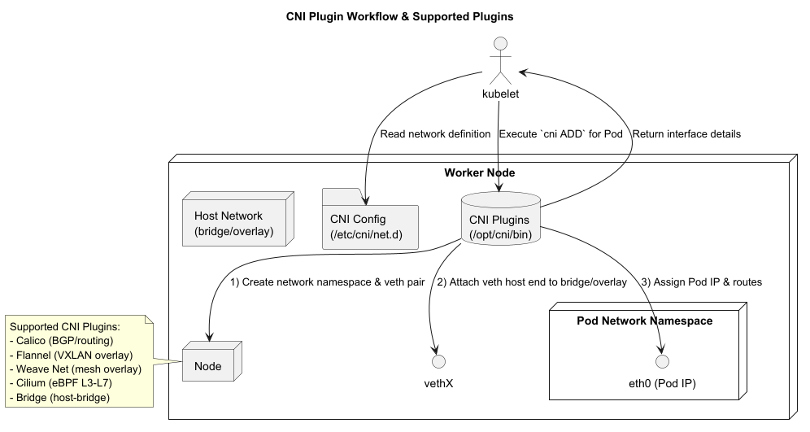
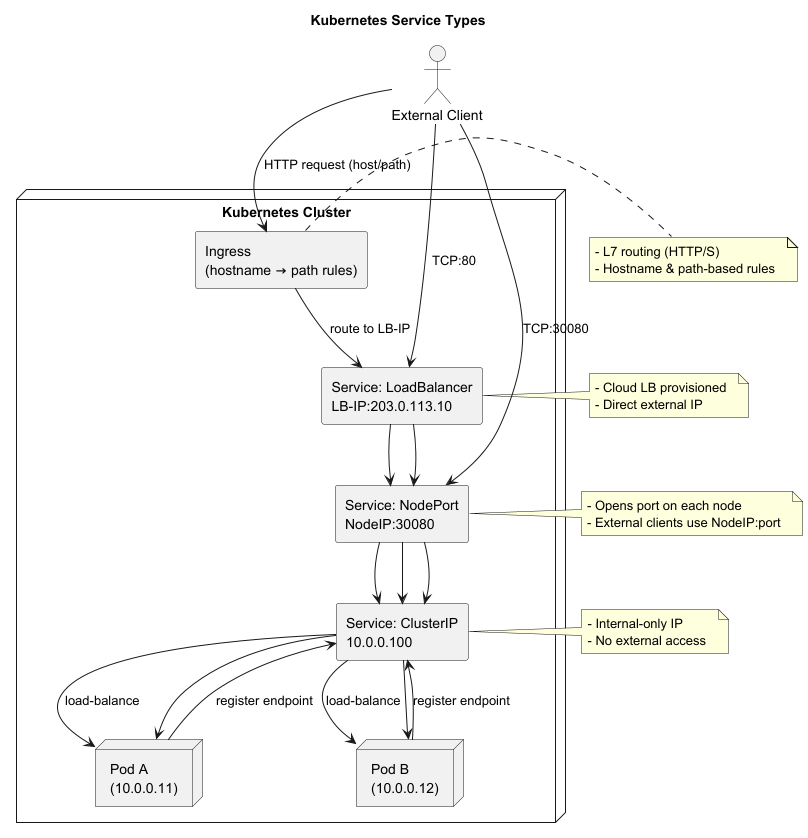

= Kubernetes Networking Primer
:revealjsdir: https://cdn.jsdelivr.net/npm/reveal.js@5
:revealjs_theme: white
:revealjs_controls: true
:revealjs_slideNumber: true
:imagesdir: .
:icons: font
:sectnums: false
:source-highlighter: highlightjs

== Kubernetes Networking Primer

Video: https://youtu.be/fxXwl9L6hxg

Kubernetes uses a flat, cluster-wide networking model: every Pod receives its own IP address, Services provide stable
discovery and load balancing, and network policies control allowed traffic. CNI plugins implement this model across
nodes and environments.

---

== Fundamental Model

1. *Flat Pod Network*
    - Every Pod receives a unique, routable IP address.
    - Pods communicate directly with no NAT (Container → Pod IP).

2. *Service Abstraction*
    - A Kubernetes Service defines a stable *ClusterIP* and DNS name.
    - Traffic to that IP routes to one of the matching Pods.

3. *NetworkPolicy*
    - Declarative rules controlling Pod-to-Pod traffic (namespaces, labels, ports).
    - Enforced by CNI plugin or eBPF layer (e.g., Calico, Cilium).

---

== Pod-to-Pod Connectivity Diagram

---

== Pod-to-Pod Connectivity

- *CNI Plugins* implement the network model:
    - *Calico*: BGP/routing
    - *Flannel*: VXLAN overlay
    - *Weave Net*: mesh overlay
    - *Cilium*: eBPF L3–L7 networking & security

- On each node:
    1. *CNI ADD*: create network namespace & veth pair
    2. Attach veth host end to bridge or overlay
    3. Assign Pod IP and routes

---

== Service Networking

- *ClusterIP*
    - Virtual IP accessible only inside cluster.
    - kube-proxy programs iptables/IPVS rules to load-balance traffic.

- *NodePort*
    - Opens a static port on every node for external access.

- *LoadBalancer*
    - In cloud environments, provisions an external load balancer with a public IP.

- *Ingress*
    - L7 routing rules (HTTP/S) managed by Ingress controller (NGINX, Traefik).

---

== DNS & Discovery

- *CoreDNS / kube-dns*
    - Pods and Services resolve names via in-cluster DNS (e.g., +my-service.my-namespace.svc.cluster.local+).

- *Headless Services*
    - No ClusterIP; DNS returns Pod IPs directly for client-side load balancing.

---

== Network Policies

[source,yaml]
----
apiVersion: networking.k8s.io/v1
kind: NetworkPolicy
metadata:
  name: allow-app-to-db
  namespace: prod
spec:
  podSelector:
    matchLabels: { role: db }
  ingress:
    - from:
        - podSelector: { role: app }
      ports:
        - protocol: TCP
          port: 5432
----

- Defines which Pods (by label) can talk to which Pods on which ports.
- When no policies exist, all Pod-to-Pod traffic is allowed by default.

---

== Multi-Cluster & Cross-Cloud

- *Service Mesh Federation* (Istio Multicluster)
- *Global DNS & Mesh* (Linkerd, Consul)
- *Network Fabric Extensions* (Submariner for direct pod networks)

---

== Best Practices

- Choose a CNI that matches your scale and security needs (e.g., Calico for policy, Flannel for simplicity).
- Always use NetworkPolicies to enforce least-privilege.
- Use headless Services for stateful sets and client-side balancing.
- Monitor network metrics (latency, throughput, dropped packets).
- Test MTU settings when using overlays (VXLAN adds 50 bytes).

---

== Summary

- Kubernetes networking provides a unified IP-per-Pod model
- Offers stable service endpoints
- Programmable security via NetworkPolicies
- Selecting the right CNI plugin and leveraging Services, Ingress, and policies enables:
    - Building resilient architectures
    - Creating secure microservices
    - Scaling effectively

